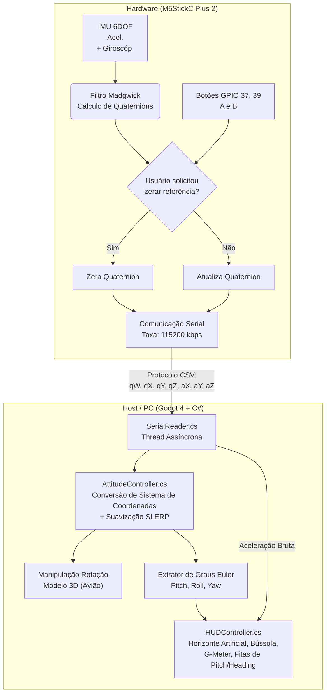

# Sistema de Telemetria e Simulação de Atitude 3D

Este projeto consiste em um sistema em tempo real de **AHRS (Attitude and Heading Reference System)** composto por duas partes principais: hardware (firmware embarcado) para captura e processamento de dados inerciais, e software para a visualização 3D simulada da atitude aliado a um painel (HUD) com instrumentos de voo completos.

---

## 🏗️ Arquitetura do Sistema

O projeto é dividido em dois subprojetos trabalhando em sincronia através de uma comunicação Serial:

1. **Tel_Atitude** (Hardware/Equipamento)
2. **simu-atitude-3d** (Software/Interface de Visualização)

---

## 📡 1. Firmware (`Tel_Atitude`)

Desenvolvido no **PlatformIO** utilizando o framework **Arduino**, o código roda nativamente em um **M5StickC Plus 2** (baseado no ESP32).

### Especificações Técnicas e Funcionamento:
- **Sensor:** IMU (Acelerômetro e Giroscópio) embutido no M5StickC Plus 2.
- **Fusão de Sensores:** Implementa uma adaptação local do algoritmo do **Filtro AHRS de Madgwick** (`MADGWICK_BETA 0.1f`), que permite combinar acelerômetro e giroscópio em altíssima velocidade mitigando o "Gimbal Lock" e processando movimentos fluídos e estáveis.
- **UI Integrada:** Possui uma pequena interface visual em sua tela LCD (`StickCP2.Display`) que sinaliza ao usuário o estado da transmissão e processa os frames.
- **Função de Zero/Referência:** A leitura dos botões do M5 ocorre via leitura direta dos GPIOs 37 e 39 para evitar travas de tempo (delaying). Há um menu interativo de confirmação na pequena tela para repor a atitude atual no "Quatérnio Identidade" (Zerar a referência/frente do sensor).

### Pacote de Dados (Serial)
Os dados são transmitidos a todo ciclo do sensor, separados por vírgulas, terminados por uma quebra de linha. 
`W, X, Y, Z, aX, aY, aZ`
* Onde as quatro primeiras posições são do quatérnio (rotação), e as três próximas são os vetores do acelerômetro, usados para o G-Meter.

---

## 🛩️ 2. Simulação e HUD (`simu-atitude-3d`)

A visualização ocorre dentro da engine de simulação **Godot 4**, mas programada quase em sua totalidade com **C# / .NET**.
A interface apresenta não só um elemento rotativo (o avião em 3D), mas todo o escopo de medições (HUD) presentes e modeladas em aeronaves do mundo real.

### Principais Scripts e Responsabilidades:

- **`SerialReader.cs`** 
  Roda em uma `Thread` independente para não atrasar a engine gráfica. Esse script capta as mensagens de texto puro emitidas pelo M5Stick (na porta `COM5` a `115200` baud rates), quebra toda a string (função `ParseLine`) e encapsula a rotação real usando `System.Threading` de forma segura (`lock`). Também gerencia cálculo de métricas de estabilidade de conexão (FPS do hardware, Pacotes perdidos, Taxa de Erros).

- **`AttitudeController.cs`**
  Responsável pela matemática do espaço geométrico tridimensional:
  1. **Conversões:** O espaço físico do hardware (IMU) tem eixos diferentes da Godot Engine. Ele converte `IMU(X, Y, Z, W)` para `Godot(X, Z, -Y, W)` de maneira natural.
  2. **Interpolação (SLERP):** Através de um *SmoothingFactor* exportado (`0.15f` padrão), o script roda um Spherical Linear Interpolation para tratar minúsculas vibrações vindas da Mão (no Hardware) na passagem dos pacotes e aplica isso ao modelo 3D para deixá-lo visualmente fluido.

- **HUD do Voo e Interfaces (`HUDController.cs` e afins)**
  A partir da atitude traduzida para os graus PITCH, ROLL e YAW, e acelerômetros, diversos instrumentos atualizam-se na tela:
  - `ArtificialHorizon.cs`: Horizonte que traduz movimentos de subida ou torção exata dos graus.
  - `CompassRose.cs` / `HeadingTape.cs`: Fitas/Rosa dos ventos informando o exato Yaw/Azimuth.
  - `PitchTape.cs`: Fita detalhada e vertical do ângulo de pitch do nariz da aeronave.
  - `GMeter.cs`: Medidor de picos de inércia em "Força G" extraída do M5Stick.

---

## 🚀 Como Executar

### Pré-requisitos
- PC rodando o **Godot 4 (versão com suporte a C#/.NET)**.
- O VS Code com o pacote PlatformIO ou a Arduino IDE para embarcar o código no M5Stick.
- Dispositivo M5StickC Plus 2 conectado por USB (checar porta, *default: COM5*).

### Passo a passo
1. **Configurando e Gravando firmware:** 
   Abra a pasta `Tel_Atitude` no VS Code suportado pela extensão **PlatformIO**. Realize o *Build* e dê *Upload* no seu dispositivo M5StickC Plus 2.
2. **Checar o M5Stick:** 
   Uma vez ligado, a tela exibirá verde: "TX OK", significando que os processos do Filtro estão transmitindo adequadamente. Para calibrá-lo de frente (Zerar eixos), aperte o Botão A, e depois novamente deite o aparelho em uma superfície plana e aperte o A denovo.
3. **Execução do ambiente 3D**:
   Verifique em qual cabo o Arduino está operando usando o *Gerenciador de Dispositivos* e certifique-se que o script `SerialReader.cs` no Inspecionador em Godot tem a porta `COMX` certa.
   Abra a pasta `simu-atitude-3d` via **Godot Engine 4 (C#)** e clique em executar projeto (F5). O modelo deverá começar a obedecer à movimentação do M5Stick interativamente, acompanhado das guias na tela.
